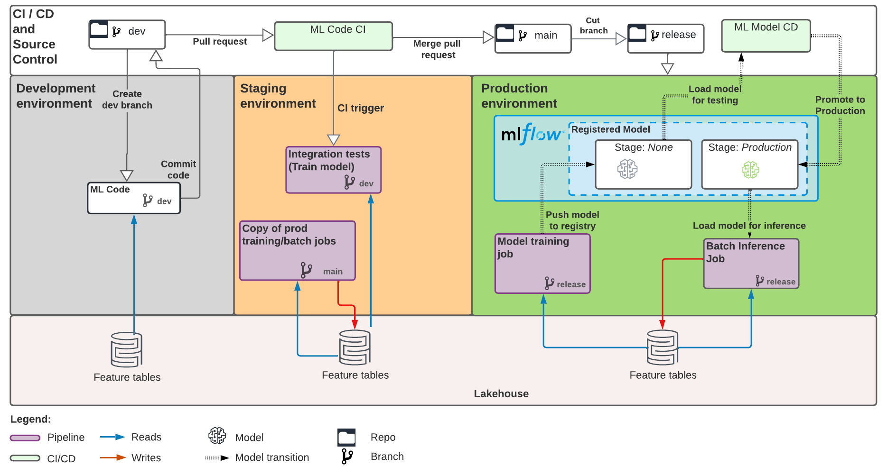

# yang-mlops-project

This directory contains an ML project based on the
[Databricks MLOps Project Template](https://github.com/databricks/mlops-project-template).

## ML pipeline structure
This project defines an ML pipeline for automated retraining and batch inference of an ML model
on tabular data.

See the full pipeline structure below, and the [template README](https://github.com/databricks/mlops-project-template#ml-pipeline-structure-and-devloop)
for additional details.




## Project structure
This project contains the following components:

| Component                  | Description                                                                                                                                                   | Docs                                                       |
|----------------------------|---------------------------------------------------------------------------------------------------------------------------------------------------------------|------------------------------------------------------------|
| ML Code                    | Example ML project code, with unit tested Python modules and notebooks using [MLflow pipelines](https://mlflow.org/docs/latest/pipelines.html) | [This file](#Getting-started)                              |
| ML Resource Config as Code | ML pipeline resource config (training and batch inference job schedules, etc) defined through [Terraform](https://docs.microsoft.com/azure/databricks/dev-tools/terraform/index) | [databricks-config/README.md](databricks-config/README.md) |
| CI/CD                      | [GitHub Actions](https://github.com/actions) workflows to test and deploy ML code and resources                                                               | [.github/workflows/README.md](.github/workflows/README.md) |
 
contained in the following files: 

```
├── steps              <- MLflow pipeline steps (Python modules) implementing ML pipeline logic, e.g. model training and evaluation. Most
│                         development work happens here. See https://mlflow.org/docs/latest/pipelines.html for details
│
├── notebooks          <- Databricks notebooks that run the MLflow pipeline, i.e. run the logic in `steps`. Used to
│                         drive code execution on Databricks for CI/CD. In most cases, you do not need to modify
│                         these notebooks.
│
├── .github            <- Configuration folder for CI/CD using GitHub Actions. The CI/CD workflows run the notebooks
│                         under `notebooks` to test and deploy model training code
│
├── databricks-config  <- ML resource (ML jobs, MLflow models) config definitions expressed as code, across staging/prod
│   ├── staging
│   ├── prod
│
├── requirements.txt   <- Specifies Python dependencies for ML code (model training, batch inference, etc) 
│
├── tests              <- Tests for the modules under `steps`
```

## Getting started

### Intro
This project comes with example ML code to train a regression model to predict NYC taxi fares using
[MLflow pipelines](https://mlflow.org/docs/latest/pipelines.html).
The subsequent sections explain how to adapt the example code to your ML problem and quickly get
started iterating on model training code.

**Note**: MLflow Pipelines currently supports regression problems, with support for other problem types (classification, etc)
planned for the future. Usage of MLflow Pipelines is encouraged but not required: you can still use the provided
CI/CD and ML resource configs to build production ML pipelines, as long as you provide ML notebooks for model training and inference under `notebooks`.
See code comments in files under `notebooks/` for the expected interface & behavior of these notebooks.

If you're not using MLflow Pipelines, follow [Databricks docs](https://docs.microsoft.com/azure/databricks/repos/index)
to develop your ML code on Databricks, and continue to [Productionizing your ML Project](#productionizing-your-ml-project).

**The remainder of "Getting Started" assumes use of MLflow Pipelines**.

### Configure your ML pipeline
Address TODOS in the pipeline configs under `pipeline.yaml`, `profiles/databricks-dev.yaml`,
and `profiles/local.yaml`, specifying configs such as the training dataset path(s) to use when developing
locally or on Databricks.

For details on the meaning of pipeline configurations, see the comments in [this example pipeline.yaml](https://github.com/mlflow/mlp-regression-template/blob/main/pipeline.yaml).
The purpose and behavior of the individual pipeline steps (`ingest`, `train`, etc) being configured are also
described in detail in
the [Regression Pipeline overview](https://mlflow.org/docs/latest/pipelines.html#regression-pipeline)
and [API documentation](https://mlflow.org/docs/latest/python_api/mlflow.pipelines.html#module-mlflow.pipelines.regression.v1.pipeline).

After configuring your pipeline, you can iterate on and test ML code under ``steps``.
We expect most development to take place in the abovementioned YAML config files and
`steps/train.py` (model training logic).

### Develop on Databricks
You can iterate on ML code by running the provided `notebooks/Train.py` notebook on Databricks using
[Repos](https://docs.microsoft.com/azure/databricks/repos/index). This notebook drives execution of
the MLflow Pipeline code defined under ``steps``. You can use multiple browser tabs to edit pipeline
logic in `steps` and run the pipeline code in the `Train.py` notebook.

The provided code examples require Databricks Runtime ML versions 11.0 and above. Using Databricks Repos also requires that you
push the template to a hosted Git repo and [set up git integration](https://docs.microsoft.com/azure/databricks/repos/set-up-git-integration).

If you'd like to iterate in your IDE but run code on Databricks, consider using the experimental
[dbx sync](https://dbx.readthedocs.io/en/latest/cli.html#dbx-sync) tool.

### Develop locally
You can also iterate on ML code locally.

#### Prerequisites
* Python 3.8+
* Install model training and test dependencies via `pip install -I -r requirements.txt -r test-requirements.txt`.

#### Trigger model training
Run `mlp run --profile local` to trigger training locally. See the
[MLflow pipelines CLI docs](https://mlflow.org/docs/latest/pipelines.html#pipelines-key-concept) for details. 

#### Inspect results in the UI
To facilitate saving and sharing results from local iteration with collaborators, we recommend configuring your
environment to log to a Databricks MLflow tracking server, as described in [this guide](https://docs.microsoft.com/azure/databricks/applications/mlflow/access-hosted-tracking-server).
Then, update `profiles/local.yaml` to use a Databricks tracking URI,
e.g. `databricks://<profile-name>` instead of a local `sqlite://` URI. You can then easily view model training results in the Databricks UI.

If you prefer to log results locally (the default), you can view model training results by running the MLflow UI:

```sh
mlflow ui \
   --backend-store-uri sqlite:///mlruns.db \
   --default-artifact-root ./mlruns \
   --host localhost
```

Then, open a browser tab pointing to [http://127.0.0.1:5000](http://127.0.0.1:5000)

#### Run unit tests
You can run unit tests for your ML code via `pytest tests`.

## Productionizing your ML project
After you've explored and validated the ML problem at hand, you may be ready to start productionizing your ML pipeline.
To do this, you or your ops team must follow the steps below:

### Create a hosted Git repo
Create a hosted Git repo to store project code, if you haven't already done so. From within the project
directory, initialize git and add your hosted Git repo as a remote:
```
git init --initial-branch=main
```

```
git remote add upstream <hosted-git-repo-url>
```

Commit the current README file to the `main` branch of the repo, to enable forking the repo:
```
git add README.md doc-images .gitignore
git commit -m "Adding project README"
git push upstream main
```

### Configure CI/CD and ML resource state storage
Follow the guide in [.mlops-setup-scripts/README.md](.mlops-setup-scripts/README.md) to
configure and enable CI/CD for the hosted Git repo created in the previous step, as well as
set up a state storage backend for ML resources (jobs, experiments, etc) created for the
current ML project.

### Configure profiles for tests, staging, and prod
Address the TODOs in the following files:
* [databricks-test.yaml](profiles/databricks-test.yaml): specify pipeline configs to use in integration tests
* [databricks-staging.yaml](profiles/databricks-staging.yaml): specify pipeline configs to use in recurring model training and batch inference
  jobs that run in the staging workspace
* [databricks-prod.yaml](profiles/databricks-prod.yaml) specify pipeline configs to use in recurring model training and batch inference
  jobs that run in the prod workspace

### Merge a PR with your initial ML code
Create and push a PR branch adding the ML code to the repository.
We recommend including all files outside of `databricks-config` in this PR:

```
git checkout -b add-ml-code
git add -- . ':!databricks-config'
git commit -m "Add ML Code"
git push upstream add-ml-code
```

Open a PR from the newly pushed branch. CI will run to ensure that tests pass
on your initial ML code. Fix tests if needed, then get your PR reviewed and merged.
After the pull request merges, pull the changes back into your local `main`
branch:

```
git checkout main
git pull upstream main
```

### Create release branch
Create and push a release branch called `release` off of the `main` branch of the repository:
```
git checkout -b release main
git push upstream release
git checkout main
```

Your production jobs (model training, batch inference) will pull ML code against this branch, while your staging jobs will pull ML code against the `main` branch. Note that the `main` branch will be the source of truth for ML resource configurations and CI/CD workflows.

For future ML code changes, iterate against the `main` branch and regularly deploy your ML code from staging to production by merging code changes from the `main` branch into the `release` branch.

### Deploy ML resources and enable production jobs
Follow the instructions in [databricks-config/README.md](databricks-config/README.md) to deploy ML resources
and production jobs.

#### Track deployed ML resources and pipelines
After deploying ML resources, you can track the state of the ML pipelines for the current project from the MLflow registered model UI. Links:
* [Staging workspace registered model](https://adb-8405830731420074.14.azuredatabricks.net#mlflow/models/staging-yang-mlops-project-model)
* [Prod workspace registered model](https://adb-1005182519515014.14.azuredatabricks.net#mlflow/models/prod-yang-mlops-project-model)

In both the staging and prod workspaces, the MLflow registered model contains links to:
* The model versions produced through automated retraining
* The Git repository containing the ML code run in the training and inference pipelines
* The recurring training job that produces new model versions using the latest ML code and data
* The model deployment CD workflow that takes model versions produced by the training job and deploys them for inference
* The recurring batch inference job that uses the currently-deployed model version to score a dataset
